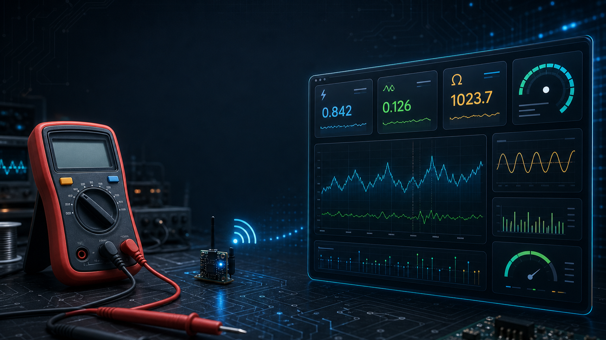
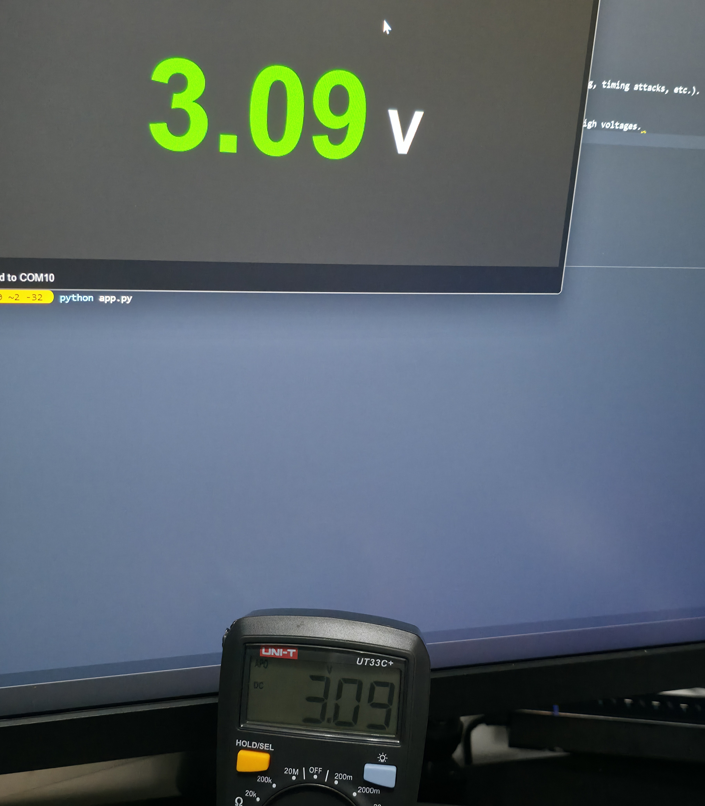
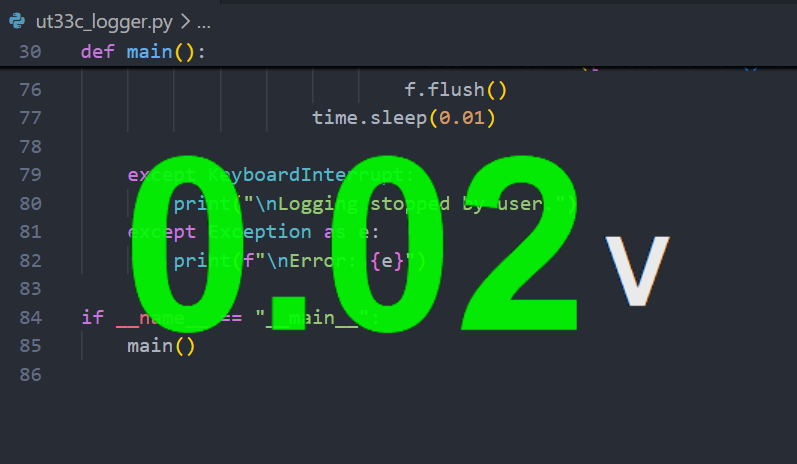
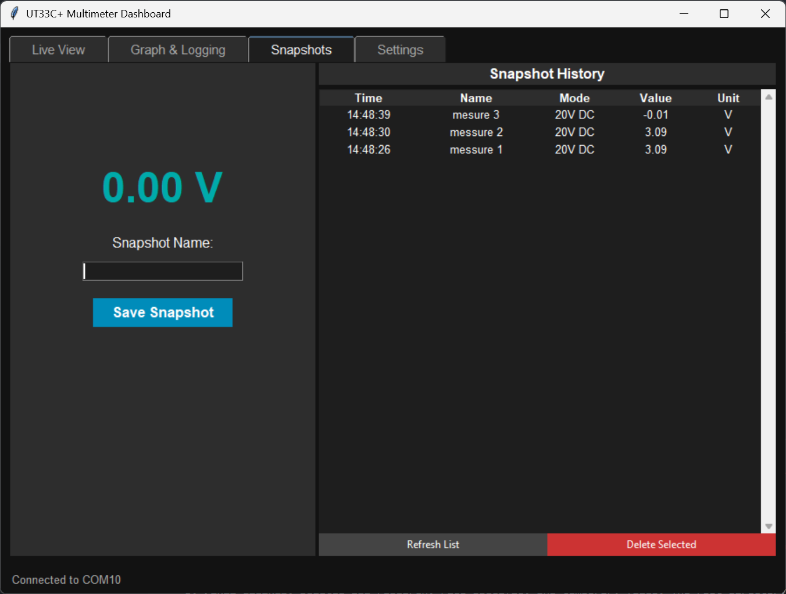
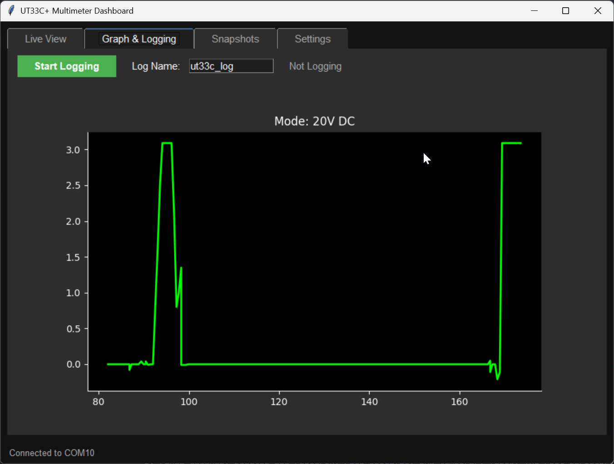

# UT33C+ Wireless Multimeter Dashboard

I turned a standard UNI-T UT33C+ digital multimeter into a wireless logging meter with a cheap Bluetooth module and a Python dashboard.

The fun bit: the meter already had an internal telemetry stream. I found it by accident while trying to shut up the continuity buzzer. This repo is the result: live readings on your PC, graphing, snapshots, and CSV logging without adding a microcontroller.



## What it does

- Talks to a ZS-040 / HC-05 / HC-06 Bluetooth module wired straight to the meter's PCB.
- Finds and connects to the paired Bluetooth serial port automatically.
- Decodes live readings for voltage, resistance, continuity, diode mode, and temperature.
- Gives you a small transparent overlay window you can keep on top while you work.
  
- Lets you save labelled snapshots of readings.
  
- Logs readings to CSV for longer tests or debugging sessions.
  

## Build your own

1. Wire a generic Bluetooth module to the meter's internal UART pad. You only need TX, VCC, and GND.
   - Use the [hardware wiring guide](docs/WIRING.md) to find the pads.
   - Use the [Bluetooth setup guide](docs/BT_SETUP.md) to configure the module.
2. Install the Python dependencies:
   ```bash
   pip install pyserial matplotlib
   ```
3. Start the dashboard:
   ```bash
   python app.py
   ```

### Command line logger

If you just want CSV logs without the GUI:

```bash
python ut33c_logger.py
```

## Docs

- [Hardware wiring guide](docs/WIRING.md): where to solder, and what not to touch.
- [Bluetooth setup guide](docs/BT_SETUP.md): setting the ZS-040 module to 2400 baud so it can talk to the meter.
- [Protocol reference](docs/PROTOCOL.md): the 10-byte binary telemetry frame format.
- [Reverse engineering notes](docs/RESEARCH_HISTORY.md): dead ends, UART fuzzing, timing attacks, and why the meter is read-only.
- [Project architecture](docs/ARCHITECTURE.md): the main Python files and a few conventions for working on the app.

## Safety warning

The multimeter's internal ground is connected to the COM probe. Do not plug the meter into a grounded PC over USB while measuring high voltages.

Use Bluetooth. The isolation is the point.
