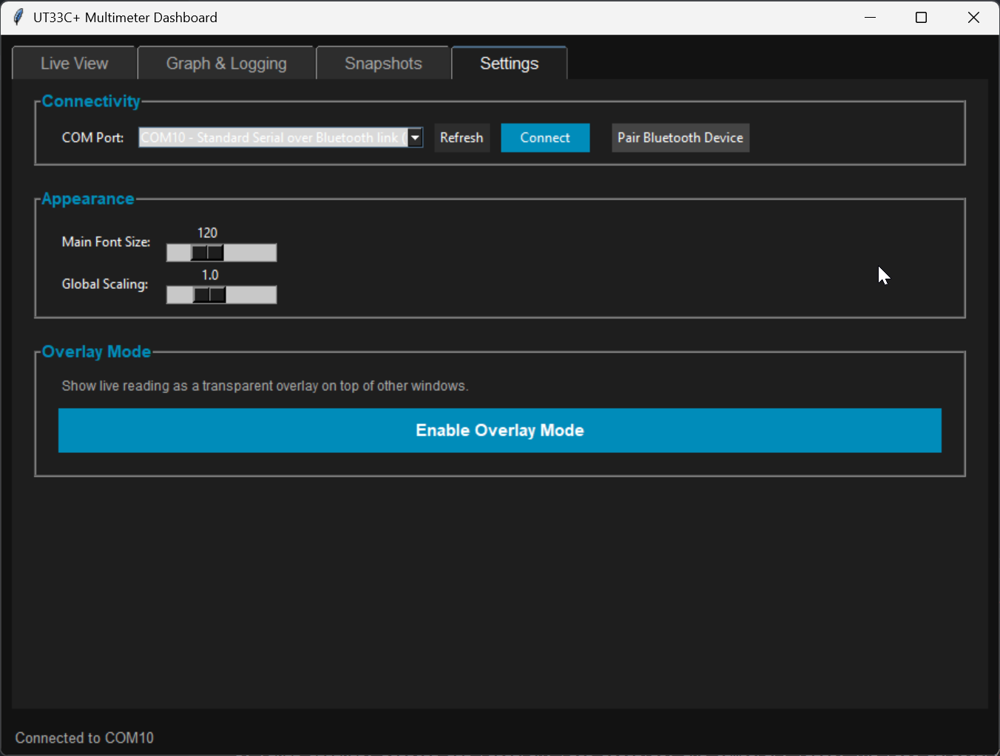

# Bluetooth Setup Guide

By adding a cheap Bluetooth module (like the ZS-040 / HC-05), you can turn your UT33C+ into a completely wireless smart meter. 

This provides **complete galvanic isolation** between your PC and the high voltages you might be measuring, keeping you and your computer safe.

## 1. Module Pre-Configuration

The UT33C+ internal UART transmits data very slowly, at **2400 baud**. 
Most generic Bluetooth modules default to 9600 baud. **You must configure your module to 2400 baud before soldering it to the meter, otherwise the data will be scrambled.**

You will need a standard USB-TTL serial adapter (like an FT232 or CH340) connected to your PC to program the module.

**For ZS-040 (HC-05) Modules:**
1. Connect the module to your USB-TTL adapter (TX to RX, RX to TX, VCC to 5V, GND to GND).
2. **Enter AT Mode:** Hold down the small button on the Bluetooth module while plugging the USB adapter into your PC. The LED on the module should start blinking slowly (about once every 2 seconds).
3. Open a Serial Terminal program (like PuTTY, CoolTerm, or the Arduino Serial Monitor).
4. Connect to your USB-TTL adapter's COM port at **38400 baud** (the mandatory speed for AT mode). Ensure your terminal sends both `CR` and `LF` at the end of lines.
5. Send the following command to set the speed to 2400 baud:
   ```text
   AT+UART=2400,0,0
   ```
   *The module should reply with `OK`.*
6. (Optional) Give your module a friendly name so the dashboard auto connects to it:
   ```text
   AT+NAME=UT33C_MultiMeter
   ```
   *The module should reply with `OK`.*

## 2. Hardware Wiring

Once the module is programmed, disconnect it from the USB adapter and follow the [Hardware Wiring Guide (WIRING.md)](WIRING.md) to solder it inside the multimeter.

## 3. Connecting to your PC

1. Turn on the multimeter. The LED on your Bluetooth module should begin flashing rapidly.
2. Open Windows Bluetooth Settings (or your OS equivalent).
3. Click "Add Bluetooth or other device" and pair with **UT33C_MultiMeter** (or whatever you named it). 
   - *The default pairing PIN is usually `1234` or `0000`.*
4. Windows will silently assign a "Standard Serial over Bluetooth link" COM port to the device in the background.

## 4. Launching the Dashboard

You are now ready to go wireless! 

Simply launch the dashboard application:
```bash
python app.py
```

Because you named the module `UT33C_MultiMeter`, the dashboard will automatically scan your PC's hidden Bluetooth COM ports, find the correct one, and connect instantly.


