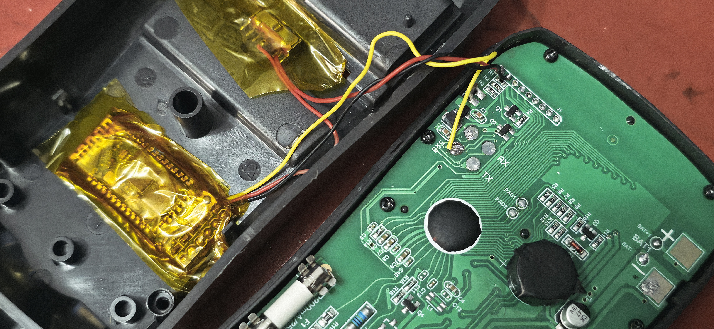

# Hardware wiring

The UT33C+ uses an SD7501, or a very similar multimeter IC. Once the meter is on, the chip continuously sends measurement data over a hidden UART port.

You only need three wires to broadcast that stream over Bluetooth.

## Finding the pads

Open the back of the UT33C+ and find the main PCB.

## Internal UART

Near the centre-bottom of the board there is a row of test pads.

- `TX`: the useful one. This sends the 2400 baud, 8N1 binary telemetry stream. Connect it to the Bluetooth module's `RXD` pin.
- `RX`: leave this alone. I tried the obvious command-injection route and it appears to be locked behind an OEM handshake. For this project the meter is read-only.

## Power and ground

Tap the meter's power rails for the Bluetooth module.

- `GND`: connect to the module's `GND` pin. This is electrically the same as the meter's `COM` probe jack.
- `VCC`: the meter runs from two AAA batteries, so this is about 3.0V. Connect it to the module's `VCC` pin.

A note on ZS-040 / HC-05 / HC-06 modules: many of them are designed around 3.6V-6V input and have an onboard regulator. Some work directly from 3.0V, some get flaky. If the Bluetooth link keeps dropping, bypass the onboard regulator or use a tiny 3V-to-5V boost converter.

## Pads to avoid

I mapped a few other pads while reverse engineering the board. They are not useful for this build.

- The 9-pad group near the top/rotary dial is for the LCD segments and keypad scan lines. It runs at about 183 Hz. Shorting or driving those pads can light every LCD segment and may damage the display driver.
- Pad 1 and pad 2 behave like reset lines. They were only useful for timing experiments and are not needed for telemetry.
